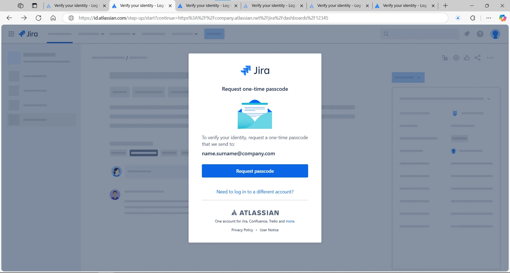
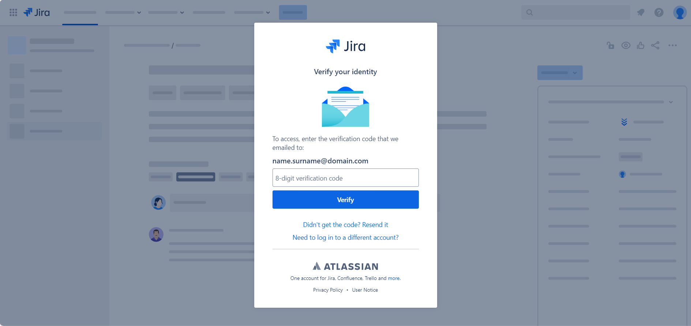
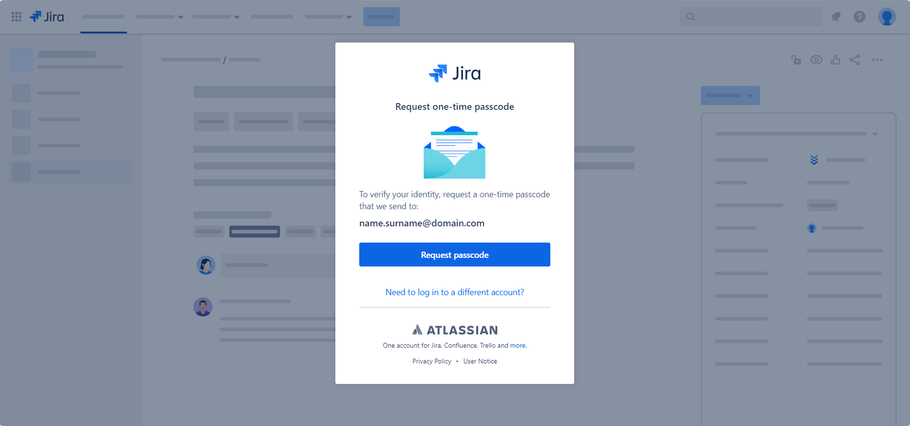
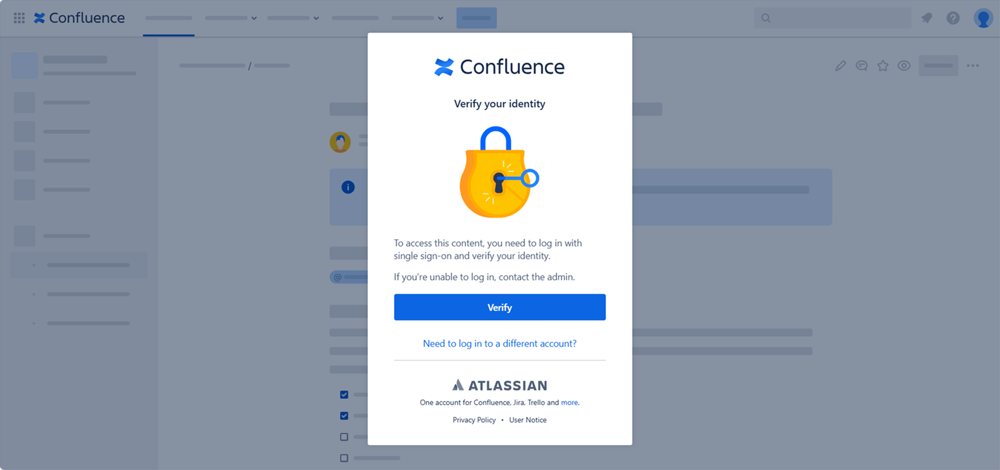

# Atlassian Verification Reload

Reload Atlassian's Jira and Confluence verification pages after a successful verification.

Once your Atlassian session expires, verify your identity once and click the extension to reload all other "Verify your identity" pages to skip the verification process again and again.

# Installation

1. Clone this repo

```
git clone https://github.com/CarpenterBug/atlassian-verification-reload
cd atlassian-verification-reload
pnpm install

// Create `.env.local` file
// Add `POSTHOG_KEY=[PostHog_Project_API_Key]`
```

2. Run `pnpm build`

3. Open the browser, go to Extensions and Manage Extensions or navigate to:

    Chrome: `chrome://extensions`

    Edge: `edge://extensions`

    Brave: `brave://extensions`

4. Enable Developer mode
5. Load unpacked
6. Select `dist` folder
7. Pin extension for easy access

# Details

Depending on your organisation's Atlassian security and access policies, more precisely the [session expiration](https://support.atlassian.com/security-and-access-policies/docs/update-verification-frequency/), Atlassian will expire your session and force you to [verify your identity](https://support.atlassian.com/atlassian-account/docs/verify-your-identity/) again every X hours by sending you an email or MFA prompt:


Even after the verification, if you have multiple Jira / Confluence tabs open, these might still be “locked”:




Clicking “Verify”, "Request passcode" or reloading the page will force you to verify your identity again.

With this extension, once you verify your identity, you will be able to reload the page and skip the verification progress again and again.

# Privacy policy

This open-source extension collects anonymous usage data through [PostHog](https://posthog.com/), an open-source platform that provides product analytics for building better products. This data is captured with [PostHog's anonymous events](https://posthog.com/docs/data/anonymous-vs-identified-events) and none of this data can personally identify specific users given it does not contain any individually identifiable personal information. All collected data is stored in PostHog's EU cloud servers and is only used to understand usage patterns and guide development priorities. Our full source code, including all analytics implementation, is publicly available in our open-source GitHub repository for transparency.

# Credits

Atlassian logo from [Atlassian Design System](https://atlassian.design/foundations/logos) and [reload icon created by mavadee - Flaticon](https://www.flaticon.com/free-icons/reload).

# Disclaimer

We are not affiliated, associated, authorized, endorsed by, or in any way officially connected with Atlassian, or any of its subsidiaries or its affiliates.
